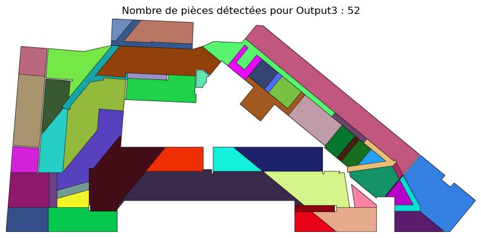
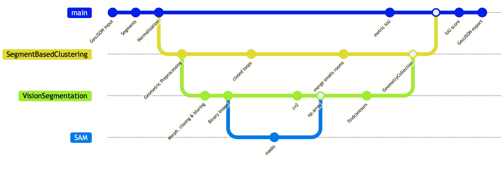
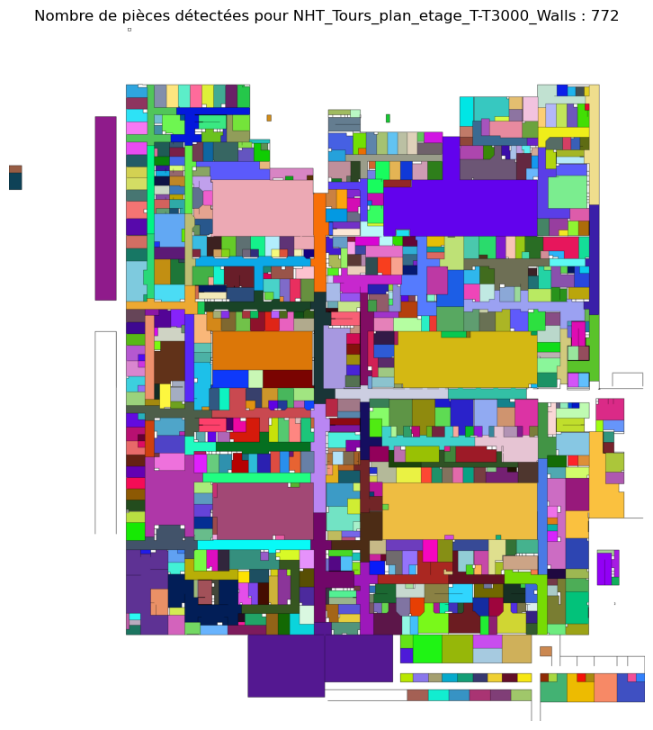

# Capstone ContourDetection

**Executive Summary**: Project done in early 2025 by four students of IP-Paris/M2 DataScience for 
VINCI-ENERGIES/DIANE aiming to detect rooms in AutoCAD floor plans in GeoJSON format.




## Introduction

Capstone ContourDetection is a project developed by four M2 Data Science students at IP-Paris in for VINCI-ENERGY/DIANE as part of their academic studies.
The goal of this project is to leverage automatic techniques to detect rooms in AutoCAD floor plans, providing an efficient and automated solution for architectural analysis and further work. 
Floors plans are exported as GeoJSON files.

## Features

- **Room Detection**: Automatically identifies rooms in AutoCAD floor plans in GeoJSON format.
- **High Accuracy**: Utilizes state-of-the-art computer vision models for precise detection on top of robust 
geometric preprocessing.
- **Scalable**: Designed to handle large and complex floor plans.
- **User-Friendly**: Outputs results in a portable format.

## Installation

To get started with Capstone ContourDetection, follow these steps:

1. Clone the repository:
    ```bash
    git clone https://github.com/your-repo/CapstoneContour.git
    cd CapstoneContour
    ```

2. Install the required dependencies:
    ```bash
    pip install -r requirements.txt
    ```
    Alternatively, you can use `conda` to create an environment and install dependencies (recommended):
    ```bash
    conda env create --name capstone_env --file=environment.yml
    conda activate capstone_env
    ```
3. Consult the [`Howto` notebook](howto.ipynb) for examples.

## Usage
The classical pipeline follow these steps:
1. A floor plan is exported to GeoJSON format.
2. The GeoJSON plan is loaded into memory as a `shapely.GeometryCollection`.
3. One of the three models from folder `models/` computes the contours of the rooms.
    - `SegmentBasedClustering` uses only geometric computation.
    - `CapstoneVisionSegmentation` relies on CV2 contour detection.
    - `SAMSegmentation` uses the famous SAM model on GPU.
4. The contours are saved back as a GeoJSON file for further use in AutoCAD.

The three models share common steps as illustrated bellow, and use utility functions from the `utils/` folder.



The plans can be pretty complex:

## Contributing

Project is closed. Feel free to contact VINCI/DIANE for further details.

## License

This project is licensed under the MIT License. See the [LICENSE](LICENSE) file for details.


<!-- Footer -->


